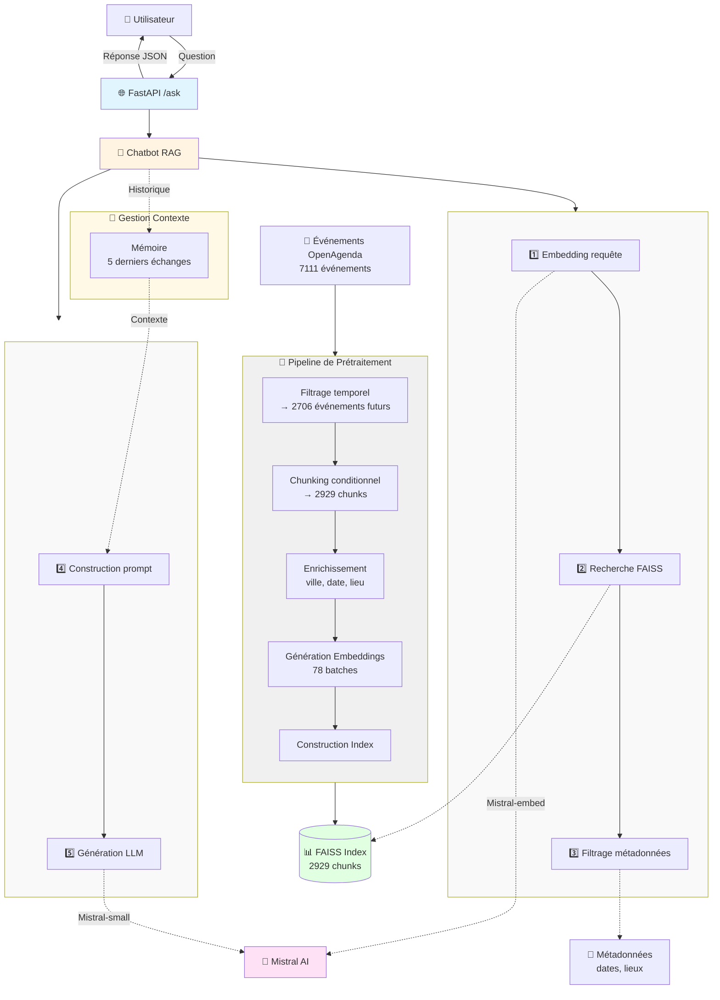

# Chatbot API - Événements Publics OpenAgenda

API de chatbot intelligent pour rechercher et recommander des événements publics dans la région PACA, utilisant RAG (Retrieval-Augmented Generation) avec Mistral AI.

## 🎯 Objectifs du projet

### Contexte

En tant que **data scientist freelance** spécialisé dans le traitement du langage naturel (NLP) et la création de systèmes intelligents, j'interviens en mission pour **Puls-Events**, une entreprise technologique qui développe une plateforme de recommandations culturelles personnalisées.

**Puls-Events** souhaite tester un nouveau **chatbot intelligent** capable de répondre à des questions utilisateurs sur les événements culturels à venir, en s'appuyant sur un système **RAG (Retrieval-Augmented Generation)** combinant recherche vectorielle et génération de réponse en langage naturel.

#### 🎯 Mission confiée
Livrer un **POC (Proof of Concept) complet** avec :
- ✅ Une **API REST exploitable** par les équipes produit et marketing
- ✅ Une **démonstration de faisabilité technique** du système RAG
- ✅ Une **validation de la pertinence métier** (recommandations pertinentes)
- ✅ Une **évaluation des performances** (temps de réponse, qualité des réponses)

#### 📊 Enjeux pour Puls-Events
Actuellement, les utilisateurs de la plateforme doivent :
- Naviguer manuellement parmi des milliers d'événements
- Utiliser des filtres rigides (date exacte, ville précise)
- Reformuler leurs recherches plusieurs fois

Le chatbot RAG doit permettre de **transformer l'expérience utilisateur** en proposant un dialogue naturel et des recommandations contextualisées.

---

### Problématique

**Comment un système RAG (Retrieval-Augmented Generation) peut-il améliorer l'expérience utilisateur et réduire la charge du service client ?**

Les défis métier identifiés :
1. **Recherche complexe** : Les utilisateurs formulent des requêtes variées ("concerts ce week-end à Marseille", "activités pour enfants en juillet")
2. **Données volumineuses** : 7111 événements avec descriptions longues (jusqu'à 3155 tokens)
3. **Contexte conversationnel** : Nécessité de maintenir un dialogue naturel ("Et à Avignon ?", "Plutôt en soirée")
4. **Fraîcheur des données** : Filtrage automatique des événements passés

**Pourquoi RAG ?**
- ✅ **Précision** : Recherche sémantique vs mots-clés (comprend "spectacle" = "concert")
- ✅ **Contexte** : Génération de réponses personnalisées basées sur les données réelles
- ✅ **Fiabilité** : Pas d'hallucinations (réponses ancrées dans les événements existants)
- ✅ **Scalabilité** : Ajout de nouveaux événements sans réentraînement du modèle

---

### Objectif du POC

Ce POC vise à **démontrer la faisabilité technique et la valeur métier** d'un assistant RAG pour Puls-Events :

#### 🎯 Objectifs techniques
1. **Recherche sémantique performante** : Temps de réponse < 2 secondes
2. **Filtrage intelligent** : Combinaison recherche vectorielle + métadonnées (date, lieu)
3. **Génération contextuelle** : Réponses naturelles en français avec sources citées
4. **Mémoire conversationnelle** : Maintien du contexte sur 5 échanges
5. **API REST documentée** : Endpoints exploitables par les équipes métier

#### 💼 Objectifs métier
1. **Réduction des sollicitations du service client** pour les demandes de recommandations
2. **Personnalisation** : Recommandations adaptées aux préférences utilisateur

#### 📊 Critères de succès
- **Pertinence** : Score de contextual relevancy > 0.7 (DeepEval)
- **Fidélité** : Score de faithfulness > 0.8 (pas d'hallucinations)
- **Complétude** : Score de answer relevancy > 0.75
- **Performance** : Temps de recherche FAISS < 100ms
- **Exploitabilité** : API documentée (Swagger) + logs structurés

---

### Périmètre

#### 📍 Zone géographique
- **Région** : Provence-Alpes-Côte d'Azur (PACA)
- **Départements couverts** : 
  - Bouches-du-Rhône (13)
  - Var (83)
  - Alpes-Maritimes (06)
  - Vaucluse (84)
  - Alpes-de-Haute-Provence (04)
  - Hautes-Alpes (05)
- **Villes principales** : Marseille, Nice, Toulon, Aix-en-Provence, Avignon, Cannes

#### 📅 Période d'événements
- **Données sources** : Événements OpenAgenda
- **Filtrage temporel** : Uniquement événements futurs

#### 📁 Données utilisées
- **Source** : OpenAgenda (plateforme officielle d'événements publics)
- **Format** : JSON structuré avec métadonnées enrichies
- **Champs exploités** :
  - Descriptions longues (texte libre)
  - Dates (début/fin, première/dernière occurrence)
  - Localisation (nom du lieu, ville, code postal, coordonnées GPS)
  - Contact (téléphone, site web)
  - Catégories d'événements

## ✨ Fonctionnalités

- 🤖 Chatbot conversationnel avec mémoire de contexte
- 🔍 Recherche sémantique d'événements via embeddings Mistral
- 📍 Filtrage géographique (ville, code postal)
- 📅 Filtrage temporel (événements futurs uniquement)
- 🎯 Recommandations personnalisées basées sur RAG
- 📊 Logging détaillé des interactions
- 🏥 Health check intégré
- 🐳 Déploiement Docker simplifié

## 🔧 Prérequis

### Logiciels requis

- **Docker** >= 20.10
- **Docker Compose** >= 2.0
- **Python** >= 3.11 (pour développement local)
- **Git**

### Clés API

- Clé API **Mistral AI** (obtenir sur console.mistral.ai)

## 📦 Installation

### 1. Cloner le repository

    git clone <url-du-repo>
    cd Projet_7

### 2. Créer le fichier d'environnement

    cp .env.example .env

Éditer le fichier .env et ajouter votre clé API :

    MISTRAL_API_KEY=your_mistral_api_key_here

### 3. Préparer les données

Les données d'événements doivent être présentes dans le dossier data/ :

    data/
    ├── evenements-publics-openagenda_26.json
    ├── chunks_with_embeddings.json
    └── faiss_index.bin

**Note** : Si les fichiers chunks_with_embeddings.json et faiss_index.bin n'existent pas, exécutez le notebook de prétraitement :

    jupyter notebook src/data_process.ipynb

Suivez les étapes du notebook pour :
1. Charger les données OpenAgenda
2. Filtrer les événements futurs
3. Créer les chunks de texte
4. Générer les embeddings avec Mistral
5. Construire l'index FAISS

## ⚙️ Configuration

### Variables d'environnement

| Variable | Description | Obligatoire |
|----------|-------------|-------------|
| MISTRAL_API_KEY | Clé API Mistral AI | ✅ Oui |
| PYTHONUNBUFFERED | Logs en temps réel | Non (défaut: 1) |

### Fichiers de configuration

- docker-compose.yml : Configuration des services Docker
- Dockerfile : Image de l'application
- requirements.txt : Dépendances Python

## 🚀 Déploiement

### Déploiement avec Docker (Recommandé)

#### Mode production

Build et démarrage :

    docker compose up -d --build

Vérifier le health check :

    curl http://localhost:8000/health

### Déploiement local (Développement)

Créer un environnement virtuel :

    python -m venv .venv

Activer l'environnement :

Linux/Mac :

    source .venv/bin/activate

Windows :

    .venv\Scripts\activate

Installer les dépendances :

    uv sync

Lancer l'API :

    uvicorn api.main_api:app --host 0.0.0.0 --port 8000 --reload

### Commandes Docker utiles

Arrêter les services :

    docker compose down

Arrêter et supprimer les volumes :

    docker compose down -v

Reconstruire l'image :

    docker compose build --no-cache

Voir les logs en temps réel :

    docker compose logs -f

## 📖 Utilisation

### Endpoints API : Interface Swagger

Documentation interactive disponible sur :

    http://localhost:8000/docs

## 🏗️ Architecture

### Structure du projet

    Projet_7/
    ├── api/
    │   └── main_api.py          # FastAPI endpoints
    ├── src/
    │   ├── chatbot.py           # Logique du chatbot
    │   └── data_process.ipynb   # Prétraitement des données
    ├── data/
    │   ├── evenements-publics-openagenda_26.json
    │   ├── chunks_with_embeddings.json
    │   └── faiss_index.bin
    ├── logs/
    │   └── chatbot.log          # Logs de l'application
    ├── tests/
    │   ├── evaluate_deepeval.py
    │   └── test_queries.json
    ├── docker-compose.yml
    ├── Dockerfile
    ├── requirements.txt
    ├── .env.example
    └── README.md

### Schéma UML

### Technologies utilisées

- **FastAPI** : Framework web asynchrone
- **Mistral AI** : Modèle LLM et embeddings
- **FAISS** : Recherche vectorielle
- **Pandas** : Manipulation de données
- **Docker** : Conteneurisation
- **Uvicorn** : Serveur ASGI

### Pipeline de traitement

**1. Prétraitement (data_process.ipynb) :**
- Chargement des données OpenAgenda
- Filtrage des événements futurs
- Chunking conditionnel (> 512 tokens)
- Génération des embeddings Mistral
- Construction de l'index FAISS

**2. Recherche (chatbot.py) :**
- Embedding de la requête utilisateur
- Recherche des k plus proches voisins dans FAISS
- Filtrage par métadonnées (date, lieu)

**3. Génération (chatbot.py) :**
- Construction du prompt avec contexte
- Appel à Mistral AI pour génération
- Formatage de la réponse

## 🧪 Tests

### Tests d'évaluation

Évaluation avec DeepEval :

    python tests/evaluate_deepeval.py

### Mise à jour des données

1. Télécharger les nouvelles données OpenAgenda
2. Placer le fichier dans data/evenements-publics-openagenda_26.json
3. Exécuter le notebook data_process.ipynb
4. Redémarrer le service :

    docker compose restart chatbot-api

### Justification des choix techniques

| Composant | Choix | Justification |
|-----------|-------|---------------|
| **Framework API** | FastAPI | Asynchrone, documentation auto, validation Pydantic |
| **LLM** | Mistral AI | Support français natif, coût optimisé, API simple |
| **Base vectorielle** | FAISS | Rapide sur CPU, pas de serveur externe requis |
| **Chunking** | Conditionnel (400 tokens) | Équilibre contexte/précision, overlap pour continuité |
| **Embedding** | mistral-embed | 1024 dimensions, optimisé pour le français |
| **Conteneurisation** | Docker | Déploiement reproductible, isolation des dépendances |